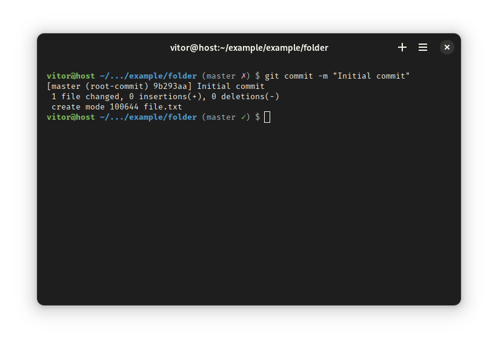

# vtr

vtr is a theme for Oh My Bash that displays development information in a concise way.

## Screenshots

## Installation

1. Install [Oh My Bash](https://github.com/ohmybash/oh-my-bash)
2. Create the directory to save the custom theme
```
$ mkdir -p "$OSH_CUSTOM/themes/vtr"
```
3. Copy the `vtr.theme.sh` file to the created directory
4. Edit the `~/.bashrc` file and change the value of the `OSH_THEME` variable
```
OSH_THEME="vtr"
```
5. Reopen the terminal or reload your .bashrc
```
source ~/.bashrc
```